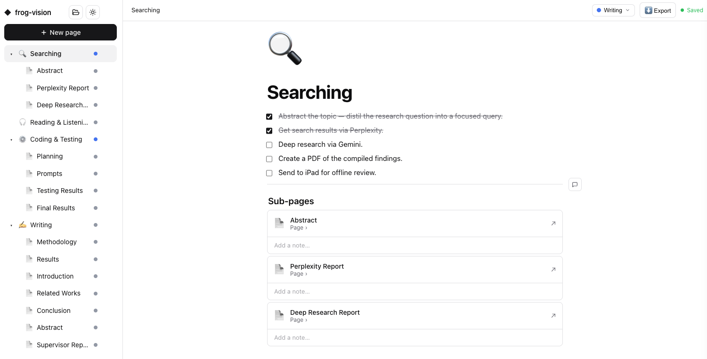

# datac — a local, Notion-style notes app

`datac` turns **any folder** into a private notes workspace. Run one command in a
project folder and it opens a block-based editor in your browser — pages, sub-pages,
columns, tables, files, comments, status, and more. Everything is stored **locally**
as JSON on your machine. No accounts, no cloud.

Built with **Next.js (App Router) + React + Tailwind v4 + shadcn/ui**. One
always-running local daemon (the Next.js standalone server) serves every workspace at
`http://localhost:4321`. The on-disk format is unchanged, so notes created by earlier
versions keep working.



---

## Requirements

- **macOS** (some features — the native file picker, "open file/folder", and the
  double-click `.dc` handler — use macOS tools). The editor itself works in any
  modern browser.
- **[Node.js](https://nodejs.org)** 20 or newer (required by Next.js 16). Check with `node --version`.

---

## Install

```bash
# 1. Get the code
git clone https://github.com/techkush/datac.git
cd datac

# 2. Install (builds the app, copies it to ~/.datac/app, puts a `datac` command on your PATH)
npm install
npm run install-cli
```

If you downloaded a ZIP instead of cloning, just `cd` into the unzipped folder and run
`npm install && npm run install-cli`.

The installer:
- copies the app into `~/.datac/app` (self-contained — the source folder is only used
  for installing/updating),
- creates a `datac` command in a folder on your `PATH` (`/usr/local/bin`,
  `/opt/homebrew/bin`, or `~/.local/bin`).

If it installs to `~/.local/bin` and that isn't on your `PATH`, add this to `~/.zshrc`:

```bash
export PATH="$HOME/.local/bin:$PATH"
```

Verify it worked:

```bash
datac help
```

---

## Use it

```bash
cd ~/projects/my-notes
datac init "My Notes"     # creates ./dataC + ./open.dc, starts the app, opens the browser
```

Later, to reopen that folder's notes:

```bash
cd ~/projects/my-notes
datac open                # or:  datac open /path/to/my-notes
```

Every folder you `datac init` is its **own workspace**, all served by the one background
daemon. Visit **http://localhost:4321** for the home page listing all your workspaces
(with a type-to-confirm **Delete** for each).

### Optional: double-click `open.dc` to open notes (macOS)

```bash
datac finder-install
```

Registers a small `DataC.app` so double-clicking an `open.dc` opens that workspace in
the browser. (If you have [`duti`](https://github.com/moretension/duti) it's set as the
default automatically; otherwise do a one-time *Get Info → Open With → DataC → Change All*.)

---

## Templates (`datac setup`)

`datac setup` scaffolds a ready-to-use workspace from a **template** instead of an empty
one. Run it in a fresh folder and give the workspace a name:

```bash
mkdir ~/projects/my-thesis && cd ~/projects/my-thesis
datac setup research "Frog-Inspired Semantic Comms"
```

That one command:

- creates the workspace (`dataC/` + `open.dc`) and starts the app,
- creates **real project folders** next to it so your files have a home from day one,
- creates one **top-level page per phase**, each holding a **to-do list** for that phase,
  with the phase's **sub-pages linked underneath the list**,
- opens it in your browser.

`setup` only writes into an **empty** folder — it never touches an existing workspace. If
the folder already has one, it stops and tells you (open the existing one, or `mkdir` a new
folder first).

### `research` — a PhD / paper research pipeline

Project folders: `search/`, `read_list/`, `code_base/`, `writing/`

| Phase page (with to-do list) | Sub-pages |
|---|---|
| 🔍 **Searching** | Abstract · Perplexity Report · Deep Research Report |
| 🎧 **Reading & Listening** | *(to-do list only)* |
| ⚙️ **Coding & Testing** | Planning · Prompts · Testing Results · Final Results |
| ✍️ **Writing** | Methodology · Results · Introduction · Related Works · Conclusion · Abstract · Supervisor Report |

### `mobileapp` — a mobile app build pipeline

Project folders: `planning/`, `prompts/`, `code/`, `deploy/`

| Phase page (with to-do list) | Sub-pages |
|---|---|
| 🧭 **Planning** | Main Idea · Key Features · Technology and Diagrams |
| 💬 **Prompting** | *(to-do list only)* |
| ⚙️ **Coding & Testing** | *(to-do list only)* |
| 🚀 **Deploying** | Appstore Details · Playstore Details |

The phase pages are ordered oldest-first so the sidebar shows them in pipeline order. Each
sub-page starts blank — fill it in as you go. Everything after scaffolding is a normal
workspace: rename pages, add blocks, change statuses, add more sub-pages, whatever you need.

---

## Commands

| Command | What it does |
|---|---|
| `datac init [title]` | Create `dataC/` + `open.dc` here and open it |
| `datac setup <template> "<name>"` | Scaffold a named workspace from a template (`research`, `mobileapp`) — creates project folders + parent pages with to-do lists and sub-pages |
| `datac open [path]` | Open an existing workspace (folder or `open.dc`) |
| `datac list` | List registered workspaces |
| `datac start` / `stop` / `restart` | Manage the background daemon |
| `datac status` | Show daemon status |
| `datac finder-install` | (macOS) enable double-click on `open.dc` |
| `datac help` | Show help |

The daemon starts automatically on `init` / `open`, so you rarely need `start`/`stop`.

---

## Editor features

- **Blocks** — text, Heading 1–4, bulleted / numbered / to-do lists, quote, code,
  divider. Hover a block for a `+` (add line) and `⋮⋮` (drag / menu: delete, duplicate,
  turn into, text & background colors).
- **Slash menu** — press `/` to insert any block, plus **columns** (2–5), **tables**,
  **images**, **files**, and page links.
- **Math / equations** — `/Math` opens a side panel: paste messy math copied from
  ChatGPT, a website or a PDF and it's **auto-cleaned into LaTeX** (Greek letters, sub/
  superscripts, hats, symbols), which you edit with a **live preview** before inserting.
  Equations render with a locally-bundled [KaTeX](https://katex.org) — no CDN, works
  offline. Click any equation to edit it again.
- **Pages & sub-pages** — `/Page` makes a nested sub-page (shown as a tree in the
  sidebar with a status dot); `/Link to page` links to an existing page. Breadcrumbs
  navigate up the tree; deleted sub-pages go to an **Orphaned pages** section and can be
  restored or re-added to their parent.
- **Files** — upload into `dataC/files/`, or **link a file by path** (no copy) that
  opens in its default app. Each file can carry a note.
- **Page tab bar** — a colored **status** dropdown (Not started / Writing / Reviewing /
  Revising / Done) and **Export Markdown** (recursively includes sub-pages).
- **Cover image + emoji icon** per page, comments on section dividers, full undo/redo,
  autosave, and light/dark theme.
- Paste from other apps keeps formatting (bold, colors, tables, links).

---

## Where your data lives

| Path | Purpose |
|---|---|
| `<project>/dataC/<id>.json` | your pages (one JSON file each) |
| `<project>/dataC/files/` | uploaded images & attachments |
| `<project>/open.dc` | manifest pointing to this workspace |
| `~/.datac/app/` | the installed app (server + UI) |
| `~/.datac/workspaces.json` | registry of all workspaces |
| `~/.datac/daemon.log` | daemon log |

Your notes are **not** inside the source/installed app folder — they stay in each
project's own `dataC/`. You can move or delete the source repo and the installed app
without affecting your notes.

---

## Update

Pull/download the latest code and re-run the installer from the source folder:

```bash
git pull        # (or download the new version)
npm install
npm run install-cli
datac restart
```

---

## Uninstall

```bash
datac stop
rm -rf ~/.datac                       # app + registry (NOT your project notes)
rm -f "$(command -v datac)"           # the datac command
rm -rf ~/Applications/DataC.app       # if you ran finder-install
```

Your notes stay in each project's `dataC/` folder until you delete them yourself.

---

## Notes

- This is a **localhost-only** app with no authentication — the right trade-off for a
  personal, single-user tool. Don't expose port 4321 to a network without adding
  safeguards.
- The native file picker, open-file/folder, and `.dc` double-click use macOS
  (`osascript` / `open`). On other platforms the editor works, but those specific
  actions are no-ops until platform equivalents are added.

---

## License

[MIT](LICENSE) © techkush
